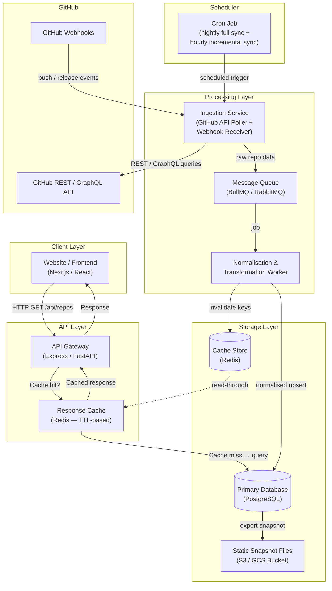

# Task 1 — Design: Scalable GitHub Data Aggregation System

## Architecture Diagram



---

## 1. Architecture Design

The system follows a **pull-then-serve** pattern with event-driven updates:

1. **Ingestion** fetches or receives repository data from GitHub.
2. **Processing** normalises and transforms that data.
3. **Storage** persists the clean data in a relational database and materialises static snapshots.
4. **Caching** sits in front of the database to serve most frontend requests from memory.
5. **API Layer** exposes structured endpoints the frontend queries.

This separation means GitHub API calls happen asynchronously in the background; the public-facing API never calls GitHub directly, eliminating GitHub rate-limit pressure from real-time user requests.

---

## 2. Core Components

| Component | Role |
|---|---|
| **Ingestion Service** | Polls GitHub's REST/GraphQL API on a schedule and receives webhook events for real-time updates. |
| **Message Queue (BullMQ/RabbitMQ)** | Decouples ingestion from processing; provides retry logic and backpressure. |
| **Normalisation Worker** | Transforms raw GitHub API payloads into the canonical schema (name, description, stars, forks, language, topics, last-updated, etc.) and upserts into PostgreSQL. |
| **PostgreSQL** | Source of truth for all repository records. Supports complex queries, full-text search on descriptions, and relational linking of organisations/topics. |
| **Redis Cache** | Two-tier: (a) response-level TTL cache keyed by query parameters; (b) materialised-view-style keys for frequently requested aggregates. |
| **API Gateway** | Single entry point for frontend requests; handles authentication, request validation, pagination, and cache look-ups before hitting the DB. |
| **Static Snapshot Store (S3/GCS)** | Nightly full-dump JSON/Parquet files used for cold-start recovery, analytics, and CDN delivery of the full catalogue. |

---

## 3. Rate Limit Handling

GitHub's REST API allows **5,000 authenticated requests/hour** per token; GraphQL allows **5,000 points/hour**.

Strategies employed:

- **Conditional requests (`If-None-Match` / `If-Modified-Since`)** — GitHub returns `304 Not Modified` when the resource has not changed. The request still consumes a rate-limit point, but no response body is transferred, reducing bandwidth and processing time significantly.
- **Token pool** — Use multiple GitHub Personal Access Tokens (PATs) or GitHub Apps (higher limits: 15,000 requests/hour per App installation). Distribute requests round-robin across the pool.
- **GraphQL batching** — Fetch 20–50 repositories in a single GraphQL query instead of individual REST calls, staying within GitHub's GraphQL node limits (~500,000 nodes/query) while still dramatically reducing total request count.
- **Incremental sync** — Only re-fetch repos where the `updated_at` timestamp has advanced since the last sync, skipping unchanged repos.
- **Exponential back-off with jitter** — When a `429` or `403 rate-limited` response arrives, pause for the duration indicated by the `X-RateLimit-Reset` header before retrying.
- **Priority queue** — Actively-updated repos (recent pushes/stars) are synced more frequently; long-dormant repos are synced weekly.

---

## 4. Update Mechanism

| Trigger | Frequency | Scope |
|---|---|---|
| **GitHub Webhooks** (`push`, `release`, `create`, `star`) | Real-time (seconds) | Single repo that fired the event |
| **Hourly incremental cron** | Every hour | Repos updated in the last 2 hours (GitHub search API: `pushed:>TIMESTAMP`) |
| **Nightly full sync** | 02:00 UTC daily | All repos; reconciles deletions and metadata drift |
| **On-demand trigger** | Manual / admin API call | Any specific repo or org |

Webhooks are the primary real-time mechanism. Because webhook delivery can fail (GitHub retries up to 3 times), the hourly incremental cron acts as a safety net, and the nightly full sync guarantees eventual consistency.

---

## 5. Data Storage Strategy

### Stored Persistently (PostgreSQL)
- Repository metadata: name, full name, owner, description, URL, visibility
- Stats: stars, forks, open issues count, watchers
- Languages, topics, license
- `pushed_at`, `created_at`, `updated_at` timestamps
- Organisation / owner mapping
- Internal sync metadata: `last_synced_at`, `etag`, `sync_status`

### Fetched Dynamically (on-demand via API Gateway → GitHub)
- **Live commit diffs** — too large and volatile to cache long-term
- **Individual file contents** — served on-demand and cached briefly (5 min TTL)
- **Real-time CI/CD status** — fetched fresh and cached for 60 seconds

This hybrid approach stores ~2 KB of structured metadata per repo (600 KB for 300 repos; ~20 MB for 10,000 repos), which is well within PostgreSQL's comfort zone, while avoiding bloated storage of high-churn binary data.

---

## 6. Scalability Plan (300 → 10,000 Repositories)

| Concern | 300 repos | 10,000 repos |
|---|---|---|
| **GitHub API calls** | ~30 GraphQL queries/hour (batch 10 repos each) | Switch to GitHub App with 15,000 req/hr; batch 20–50 repos/query (respecting GraphQL node limits) → ~200–500 queries |
| **Database** | Single PostgreSQL instance | Add read replicas; partition table by `org_id`; add composite indexes on `(org, updated_at)` |
| **Ingestion throughput** | 1 worker | Horizontally scale workers; partition repos by org prefix across workers |
| **Cache** | Single Redis node | Redis Cluster (3+ shards); data distributed across 16,384 hash slots for horizontal scaling |
| **Storage** | ~20 MB | ~670 MB — trivial for PostgreSQL; archive cold repos to S3 |
| **Token quota** | 1 GitHub App | 1 App installation per org (each gets its own quota) |
| **Queue** | BullMQ single queue | Multiple priority queues; dead-letter queue for failed syncs |

At 10,000 repos the full nightly sync takes ~100 GraphQL queries (100 repos each). Even at 100 queries that is well under the 15,000-request limit, leaving headroom for webhooks and incremental updates.

---

## 7. Performance Optimization

- **Redis TTL cache on API responses** — Most frontend requests hit Redis (< 1 ms) instead of PostgreSQL. TTL is set per endpoint: listing endpoints 5 min, individual repo detail 1 min.
- **Cache warming** — On startup and after each nightly sync, pre-populate Redis with the top-level listing and the most-viewed repositories.
- **Static CDN snapshots** — The nightly JSON snapshot (all repos) is uploaded to S3 and served via CloudFront/Cloudflare CDN with a long `max-age`. The website can render the full catalogue from this static file without touching the backend, achieving sub-50 ms TTFB globally.
- **Database indexes** — `(org_id, updated_at DESC)`, `(language)`, `(stars DESC)` indexes cover the most common query patterns.
- **Pagination & cursor-based listing** — Prevents full-table scans; the API returns 50 repos per page with a cursor.
- **HTTP/2 and compression** — API gateway uses gzip/Brotli; frontend fetches are batched.
- **Stale-while-revalidate** — Redis serves stale data while a background refresh is triggered, eliminating user-visible cache-miss latency.

---

## 8. Failure Handling

| Failure Mode | Detection | Response |
|---|---|---|
| **GitHub API 429 / rate-limit exhausted** | `X-RateLimit-Remaining: 0` header | Pause the ingestion worker until `X-RateLimit-Reset`; continue serving cached data |
| **GitHub API 5xx / network timeout** | Non-2xx response after 3 retries | Move job to retry queue with exponential back-off (1 s → 2 s → 4 s); alert after 5 consecutive failures |
| **Repo deleted / moved** | 404 from GitHub | Mark record as `archived` in DB; continue serving last-known data with a staleness flag; remove after 7-day grace period |
| **Webhook delivery failure** | Hourly incremental cron catches missed events | No single point of failure; the cron is an automatic fallback |
| **PostgreSQL downtime** | Health check fails | API gateway returns cached Redis responses; queue ingestion writes for replay; serve static CDN snapshot as last resort |
| **Redis downtime** | Health check fails | API falls through directly to PostgreSQL (cache bypass mode); Redis self-heals and cache warms automatically on restart |
| **Worker crash mid-sync** | Job not acknowledged in queue | Queue re-delivers the job after visibility timeout (30 s); idempotent upsert logic prevents duplicate records |

---

## 9. API Flow

### Endpoints

| Method | Path | Description |
|---|---|---|
| `GET` | `/api/repos` | List all repos (paginated, filterable by org, language, topic) |
| `GET` | `/api/repos/:owner/:name` | Get full metadata for a single repo |
| `GET` | `/api/repos/search?q=...` | Full-text search over name + description |
| `GET` | `/api/orgs` | List organisations tracked by the system |
| `GET` | `/api/stats` | Aggregate stats (total repos, most starred, most active, language breakdown) |
| `POST` | `/internal/webhook` | Receives GitHub webhook payloads (protected by HMAC signature) |
| `POST` | `/internal/sync` | Admin-triggered manual sync for a specific repo or org |

### Frontend → Backend Flow

```
Browser
  │
  │  GET /api/repos?org=c2siorg&page=1&limit=50
  ▼
API Gateway
  ├─ Validate query params
  ├─ Check Redis key "repos:c2siorg:page1:limit50"
  │     ├─ HIT  → return JSON (< 1 ms)
  │     └─ MISS → query PostgreSQL → store in Redis (TTL 5 min) → return JSON
  └─ Return 200 JSON { repos: [...], cursor: "...", total: 300 }
```

### Caching Behaviour

- **Cache key schema:** `repos:{org}:{filters_hash}:{page}:{limit}`
- **TTL:** 5 minutes for listing, 60 seconds for single-repo detail.
- **Invalidation:** When the Normalisation Worker upserts a repo, it deletes all Redis keys matching `repos:{org}:*` for that organisation.
- **Stale-while-revalidate:** If the key is within 30 seconds of expiry, the response is served immediately and a background job refreshes the cache.

---

## 10. Technology Choices and Justification

| Layer | Technology | Justification |
|---|---|---|
| **Frontend** | Next.js (React) | SSG/ISR support generates static pages at build time from the snapshot; SWR hooks handle real-time re-fetching gracefully. |
| **API Gateway** | Node.js + Express (or FastAPI/Python) | Lightweight, widely understood, excellent Redis and PostgreSQL client ecosystems. FastAPI chosen if Python workers share code with the ingestion service. |
| **Ingestion Service** | Node.js / Python worker | Octokit (JS) or PyGitHub (Python) provide first-class GitHub API clients with built-in retry and rate-limit helpers. |
| **Message Queue** | BullMQ (Redis-backed) | Zero additional infrastructure — reuses the existing Redis instance; supports priority queues, delayed jobs, and dead-letter queues. For very high scale, switch to RabbitMQ or AWS SQS. |
| **Primary Database** | PostgreSQL 15 | ACID compliance, JSONB columns for flexible metadata, `pg_trgm` for fast text search, mature ecosystem, easy horizontal read-scaling with replicas. |
| **Cache / Queue store** | Redis 7 | Sub-millisecond reads, TTL-native, supports BullMQ. Cluster mode available for horizontal scaling. |
| **Static snapshot store** | AWS S3 + CloudFront | Cheap, globally distributed, zero maintenance. A single `repos-snapshot.json` served from CDN covers 95% of page loads with no backend involvement. |
| **Scheduler** | node-cron / Celery Beat | Lightweight in-process cron for small deployments; replace with Kubernetes CronJob or AWS EventBridge for production. |
| **Infrastructure** | Docker + Kubernetes (or Railway/Render for MVP) | Containerised workers scale horizontally; Kubernetes HPA automatically scales ingestion workers under load. Railway/Render used for rapid initial deployment. |
| **Observability** | Prometheus + Grafana / Datadog | Track sync lag, cache hit rate, API latency, queue depth, and rate-limit headroom in real time. |
| **GitHub integration** | GitHub App | Higher rate limits (15,000 req/hr/installation), fine-grained permissions, webhook management, no personal token dependency. |

---

*Document version: 1.0 — Task 1 Design only. Task 2 (Development) is out of scope.*
